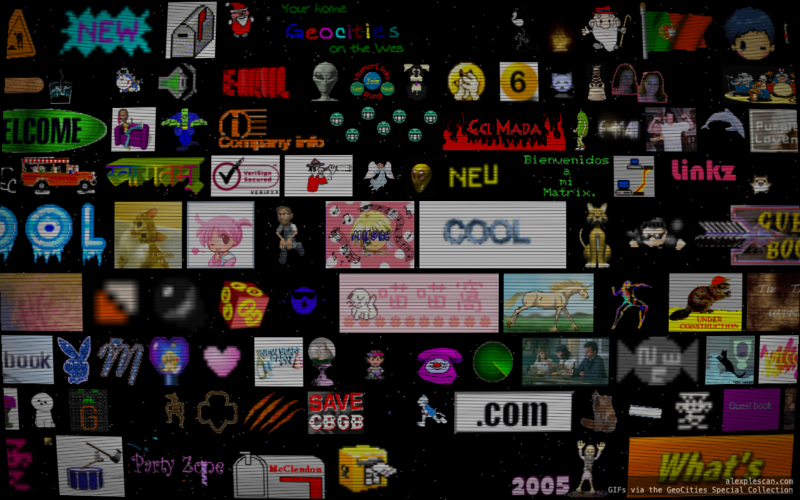

# gifs-grid

Scrolling mosaic of late‑90s / early‑00s GIF ephemera sourced from the Internet Archive's GeoCities Special Collection.

**[gifs.alex.works](https://gifs.alex.works)**

## Getting started

This is a toy project that doesn't include a comprehensive guide. If you wanna run this yourself the gist is:

1. Install dependencies (Go, Python with uv package manager, Just)
1. Source GIFs and place them in `gifs/gifs`
1. (optionally) deduplicate them and classify NSFW ones with `just gifs_clean`
1. Run the server with `just dev`

## License

MIT (unless otherwise noted in individual files). GIF assets retain their original copyrights/attributions from the Internet Archive GeoCities collection.

## Attribution

GIFs: The Internet Archive's [GeoCities Special Collection](https://archive.org/web/geocities.php), via [gifcities](https://gifcities.org/)

Author: https://alexplescan.com

